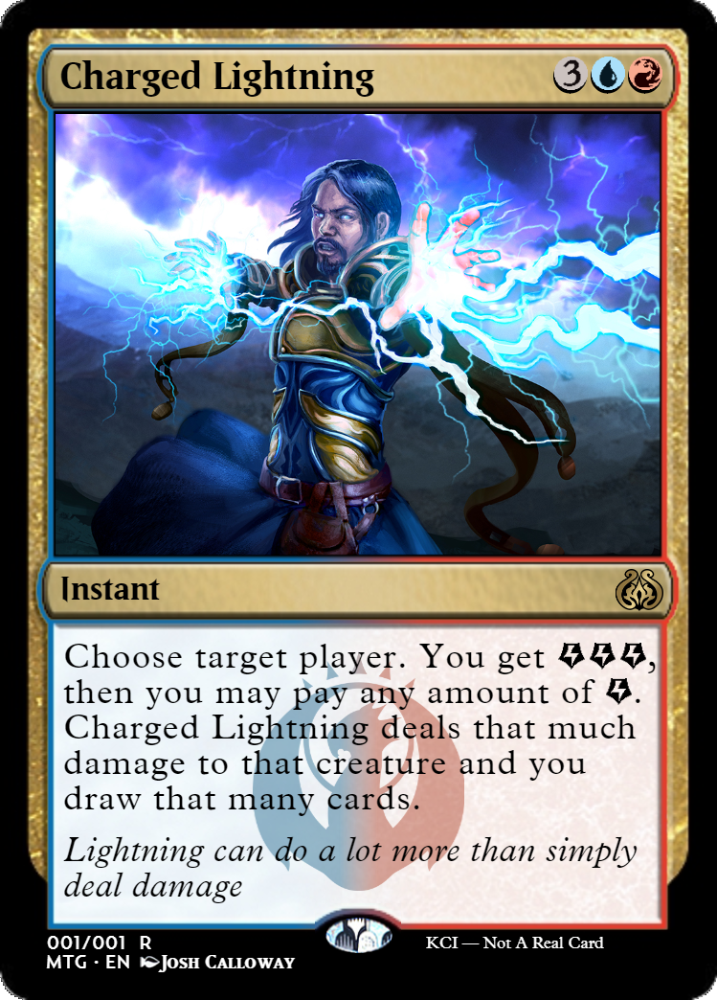

# Kyles-Card-Imager
To install KCI, click the green button that says "clone or download," then click "download zip." After that all you need to do is unzip the folder and open it. Run the html file by double clicking it.

 ← Help me keep playing magic by donating any amount!

 ← Or join Pucatrade with this link
  
here are some samples:
  

